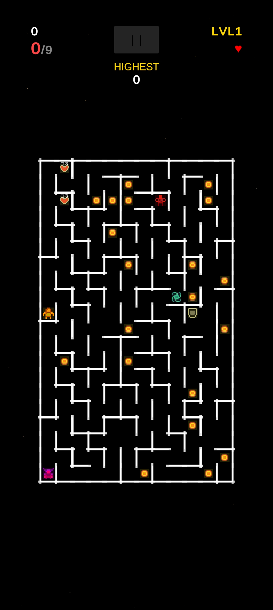

# THROUGH THE MAZE

## 🎯 Game Overview

**Through The Maze** is a fast-paced 2D mobile game where players must navigate through an infinite procedurally generated maze while collecting crystals and avoiding various enemy types. The game features progressive difficulty, power-ups, and an endless mode for competitive high score grinding.

  
  &nbsp;&nbsp;&nbsp;&nbsp;
  

### Key Features
- 🗺️ **Procedurally Generated Mazes** - Every playthrough offers a unique maze layout using the Recursive Backtracker algorithm
- 📱 **Mobile-Optimized Controls** - Intuitive swipe controls (with keyboard support for testing)
- ⚡ **Progressive Difficulty** - Five structured levels that transition into infinite mode
- 👾 **Four Enemy Types** - Each with unique behaviors and strategies
- 💎 **Power-ups & Collectibles** - Strategic items to aid survival
- 🏆 **High Score System** - Compete against yourself with persistent score tracking
- 🎨 **Polished Visuals** - Professional sprite-based graphics with particle effects and animations

---

### Objective
Collect 9 crystals per level to advance. In infinite mode (Level 5+), crystals continuously respawn for endless gameplay!

---

## 👤 The Player

Your character appears as a **green square sprite** and starts each level in the top-left corner of the maze. The player has:
- **Health System**: Start with 1 heart, lose health when hit by enemies
- **Movement**: Grid-based movement through maze corridors
- **Invulnerability Frames**: Brief protection after taking damage

---

## 👾 Enemies

### 🔴 Hunter Enemy
The most dangerous foe! Uses A* pathfinding to actively chase the player through the maze.
- **Behavior**: Intelligently pursues player using shortest path
- **Speed**: Moderate (4 units/sec)
- **Damage**: Removes 1 health on contact
- **Strategy**: Keep moving and use walls to break line of sight

### 🟠 Patrol Enemy
The blocker! Moves in a straight line until hitting a wall, then changes direction.
- **Behavior**: Patrols corridors randomly
- **Speed**: Slow (2 units/sec)
- **Damage**: None - blocks passage only
- **Strategy**: Patrol enemies don't hurt you, but can trap you near other threats

### 🟢 Teleporter Enemy
The unpredictable one! Randomly teleports around the maze.
- **Behavior**: Teleports to random empty positions every 3 seconds
- **Speed**: None (teleports instead)
- **Damage**: Removes 1 health on contact
- **Strategy**: Hard to predict - stay alert and keep moving

### 🟣 Spawner Enemy
The multiplier! Creates mini-hunter enemies that hunt the player.
- **Behavior**: Spawns mini-hunters every 15 seconds (max 3 active)
- **Speed**: Stationary
- **Damage**: Spawned mini-hunters deal 1 health damage
- **Mini-hunters**: Last 12 seconds before disappearing
- **Strategy**: Prioritize eliminating spawners to prevent being overwhelmed

---

## 💎 Collectibles

### Crystals (Yellow/Gold)
The primary objective! Collect 9 to complete a level.
- **Points**: 10 points × combo multiplier
- **Combo System**: Collect crystals quickly (within 2 seconds) to build combos
  - 2+ crystals in combo = 2× multiplier
  - 4+ crystals in combo = 3× multiplier
  - And so on...

### ❤️ Health Pickup (Red Heart)
Restores health and provides survival bonus.
- **Effect**: Adds 1 health (max shown by red hearts in UI)
- **Points**: 100 points
- **Duration**: 5 seconds (timed collectible with countdown)
- **Spawn**: 2-4 per level

### 🛡️ Shield (Green)
Temporary invulnerability to enemy damage.
- **Effect**: Protects from one enemy hit
- **Duration**: 5 seconds
- **Points**: 20 points
- **Visual**: Player turns green while shielded
- **Spawn**: 1 per level

### ⚡ Speed Boost (Orange/Red)
Doubles your movement speed!
- **Effect**: 2× movement speed
- **Duration**: 4 seconds
- **Points**: 25 points
- **Visual**: Player turns orange
- **Spawn**: 1 per level

### ❄️ Freeze Bomb (Blue)
Freezes all enemies in place.
- **Effect**: Immobilizes all enemies for 3 seconds
- **Points**: 40 points
- **Visual**: Frozen enemies turn light blue
- **Spawn**: 1 per level
- **Strategy**: Perfect for escaping dangerous situations

---

## 📊 Level Progression

### Level 1: Introduction
- **Enemies**: 1 Hunter, 1 Patrol
- **Crystals**: 9 (20 total spawned)
- **Focus**: Learn basic movement and enemy patterns

### Level 2: Escalation
- **Enemies**: 2 Hunters, 1 Patrol
- **Crystals**: 9 (20 total spawned)
- **Focus**: Multiple threats require careful navigation

### Level 3: Teleportation
- **Enemies**: 2 Hunters, 1 Patrol, 1 Teleporter
- **Crystals**: 9 (20 total spawned)
- **Focus**: Dealing with unpredictable enemies

### Level 4: Maximum Threat
- **Enemies**: 2 Hunters, 1 Patrol, 1 Teleporter, 1 Spawner
- **Crystals**: 9 (20 total spawned)
- **Focus**: Managing multiple enemy types simultaneously

### Level 5+: Infinite Mode
- **Enemies**: 1 Hunter, 1 Patrol, 2 Teleporters, 2 Spawners
- **Crystals**: Infinite (respawn continuously)
- **New Collectibles**: Spawn every 12 seconds
- **Focus**: Pure survival and high score grinding

---

## 🏆 Scoring System

### Points Breakdown
- **Crystal**: 10 points × combo multiplier
- **Health Pickup**: 100 points
- **Shield**: 20 points
- **Speed Boost**: 25 points
- **Freeze Bomb**: 40 points
- **Level Completion**: 100 points
- **Time Bonus**: 
  - Under 30 seconds: +100 points
  - 30-45 seconds: +50 points
  - 45-60 seconds: +25 points

### High Score
Your best score is saved locally and displayed on the main menu and HUD.

*Developed with Unity 6.2 for iOS and Android*